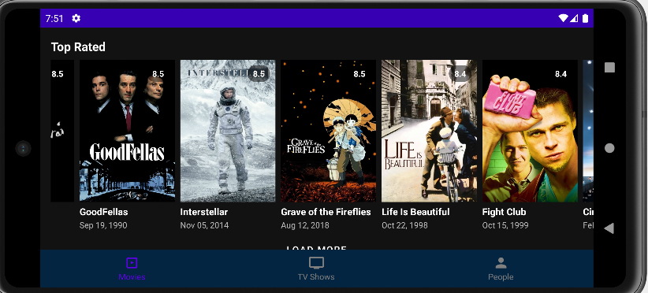

# Movies‑TVShows‑App

## Table of Contents
- [Description](#description)  
- [Key Features](#key-features)  
- [Screenshots](#screenshots)  
- [Skills Used](#skills-used)  

---

## Description

**MoviesApp** is a fully-featured, Android application built for exploring movies, TV shows, and entertainment personalities — all powered by the TMDB API.

This isn't your average API demo. This app is architected using **MVVM**, **Jetpack Components**, **Coroutines**, and a clean separation of concerns. It delivers region-specific content, preserves scroll position, and handles edge cases like missing images or networks connections.

Whether you’re checking out the latest blockbuster, binging a trending show, or geeking out on filmography — this app makes discovering great content a smooth, responsive, and visually polished experience.

In short, It’s the movie app you’d actually want to use.

---

## Key Features
1. **Multi‑Content Exploration**  
   - Browse _Popular_, _Now Playing_, _Top Rated_, _Upcoming_, and _Trending_ movies.  
   - Discover _Popular_, _Airing Today_, _On TV_, and _Top Rated_ TV series.  
   - Explore profiles of industry professionals (actors, directors, etc.).

2. **Advanced Search Functionality**  
   - Search across movies, TV shows, and industry people.

3. **Region‑Aware Content**  
   - Uses device locale to fetch region‑specific data (release dates, airing schedules).

4. **Pagination with “Load More”**  
   - Incrementally load additional items while preserving scroll position.

5. **Detailed Information Views**  
   - Detail screens with images, ratings, synopsis, cast lists, and metadata.

---

## Screenshots

### Main Sections
| Home | Movies | TV Shows |
| :--: | :----: | :------: |
|  |  |  |
|  |  |  |
|  |  |  |

### Detail Views
| People | Movie Detail | TV Show Detail |
| :----: | :----------: | :------------: |
|  |  |  |
|  |  |  |
|  |  |  |

### Extras
| Person Detail | Search | Landscape Mode |
| :-----------: | :----: | :------------: |
|  |  |  |
|  |  |  |

---

## Skills Used

  
  
  
  
  
  
  
  

